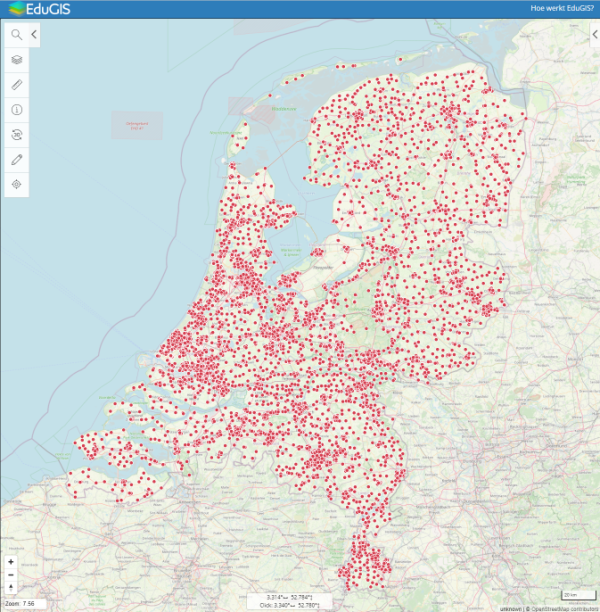

# data-nl-scholen
Conversion and geocoding of dutch school locations (elementary and secondary education)

## Prerequisites
* postgresql
* postgis
* ogr2ogr
* iconv
* (Recent) BAG data (table 'bagadres')

## Steps
1. download address data (CSV)
2. convert ANSI to UTF8 (CSV-ANSI => CSV-UTF8)
3. import into Postgres database (ogr2ogr)
4. use sql queries to create geocoded table (using BAG data)
5. export to geojson


## Download
Download adresses via:
https://www.rijksoverheid.nl/contact/contactgids/scholen-in-nederland

URLS (updated 2024-11-22):   
[02-alle-schoolvestigingen-basisonderwijs.csv](https://www.duo.nl/open_onderwijsdata/images/02.-alle-schoolvestigingen-basisonderwijs.csv) (basisscholen)   
[02-alle-vestigingen-vo.csv](https://www.duo.nl/open_onderwijsdata/images/02.-alle-vestigingen-vo.csv) (voortgezet onderwijs)
[01-adressen-instellingen.csv](https://www.duo.nl/open_onderwijsdata/images/01.-adressen-mbo-instellingen.csv) (mbo)  
[01-instellingen-hbo-en-wo.csv](https://www.duo.nl/open_onderwijsdata/images/01.-instellingen-hbo-en-wo.csv) (hogescholen en universiteiten)
[02-instellingen-pabo.csv](https://www.duo.nl/open_onderwijsdata/images/02-instellingen-pabo.csv) (pabo) 
[09.-alle-vestigingen-sbo-so-en-vso.csv](https://duo.nl/open_onderwijsdata/images/09.-alle-vestigingen-sbo-so-en-vso.csv) (speciaal en voorgezet speciaal onderwijs)
[01.-leerlingen-po-soort-po-cluster-leeftijd-2023-2024.csv](https://duo.nl/open_onderwijsdata/images/01.-leerlingen-po-soort-po-cluster-leeftijd-2023-2024.csv)

The above csv files are ANSI-encoded (alias windows-1252).

## Convert to UTF8
```bash
mkdir data
iconv -f "windows-1252" -t "UTF-8" 02.-alle-schoolvestigingen-basisonderwijs.csv -o data/02-alle-schoolvestigingen-basisonderwijs-utf8.csv
iconv -f "windows-1252" -t "UTF-8" 02.-alle-vestigingen-vo.csv -o data/02-alle-vestigingen-vo-utf8.csv
iconv -f "windows-1252" -t "UTF-8" 01.-adressen-mbo-instellingen.csv -o data/01-adressen-instellingen-utf8.csv
iconv -f "windows-1252" -t "UTF-8" 01.-instellingen-hbo-en-wo.csv -o data/01-instellingen-hbo-en-wo-utf8.csv
iconv -f "windows-1252" -t "UTF-8" 02-instellingen-pabo.csv -o data/02-instellingen-pabo-utf8.csv
iconv -f "windows-1252" -t "UTF-8" 09.-alle-vestigingen-sbo-so-en-vso.csv -o data/09-alle-vestigingen-sbo-so-en-vso-utf8.csv
```

## import into Postgresql
```bash
export PGUSER=mydbuser
export PGPASSWORD=mydbpassword
export PGHOST=mypostgreshost
export PGDATABASE=mydbname
./importtopostgres.sh
```

## create table 'scholen'
```bash
export PGUSER=mydbuser
export PGPASSWORD=mydbpassword
export PGHOST=mypostgreshost
export PGDATABASE=mydbname
psql < geocode.sql
```

## export to geojson
```bash
ogr2ogr -f "GeoJSON" scholen.geo.json PG:"host=YOUR_HOST dbname=YOUR_DB user=YOUR_USER password=YOUR_PASS port=5432" "scholen"
```

## todo
toevoegen leerlingen voortgezet onderwijs: https://duo.nl/open_onderwijsdata/voortgezet-onderwijs/aantal-leerlingen/aantal-leerlingen.jsp
toevoegen leerlingen basisonderwijs: https://duo.nl/open_onderwijsdata/primair-onderwijs/aantal-leerlingen/

## view the result
drag resulting file 'scholen.geo.json' to for example [the Dutch EduGIS map](https://kaart.edugis.nl/v2/#configurl=maps/layers.json)   

